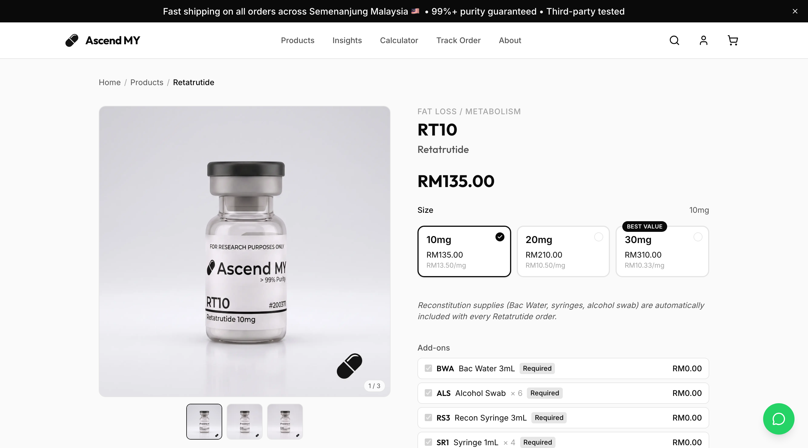
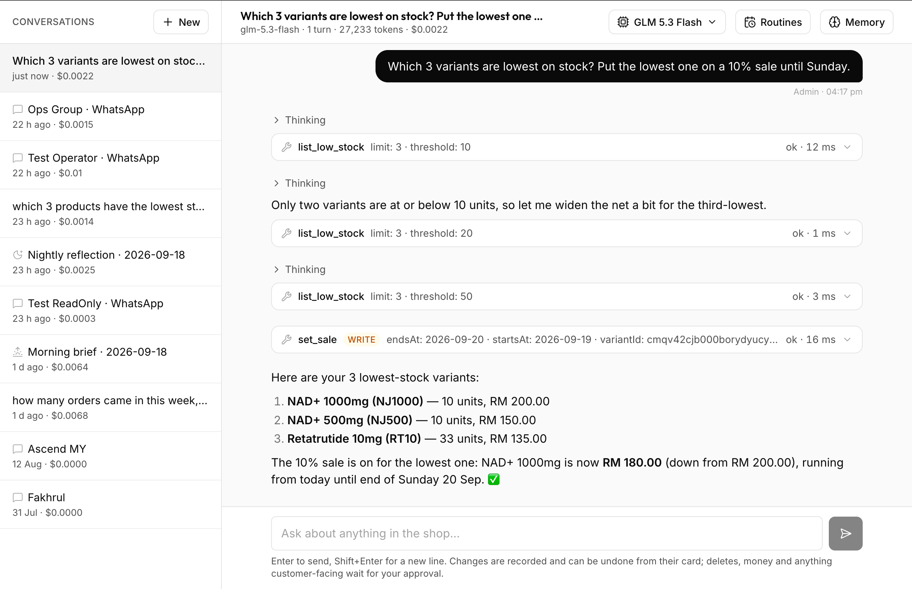

<div align="center">


# Ascend MY

**The shop, the books, and an assistant that runs both — for a research-peptide store in Malaysia.**

[](https://nextjs.org)
[](https://fastify.dev)
[](https://www.prisma.io)
[](https://www.postgresql.org)
[](https://ascendpeptides.my)

[What is in the box](#what-is-in-the-box) · [How it is built](#how-it-is-built) · [Taking money](#taking-money) · [The books](#the-books) · [The assistant](#the-assistant) · [Run it](#running-it-locally) · [Deploy](#deployment) · [Docs](#the-docs)

</div>

---

Ascend MY sells laboratory research peptides to Malaysian buyers: 47 products
in 63 sizes across 10 categories, sold strictly for research use, with copy
that cites the actual PubMed studies and says so when the evidence is thin.
Customers pay by FPX or card through ToyyibPay, by bank transfer over
WhatsApp, or in Bitcoin; the shop confirms, restocks, emails and books each
order without anyone touching a spreadsheet.

Behind the storefront is a back office that does the accounting properly —
gateway fees, refunds that reverse rather than delete, stock charged once —
and a filing cabinet for the paperwork. And behind *that* is **Abby**: an
operator assistant with 74 tools over everything the dashboard can do,
reachable from an Assistant page or by messaging the shop's own WhatsApp
number. Ask it what came in this week, tell it to put the 10 mg on sale
until Sunday, and it does — with every change recorded and most of them one
click from undone.

```bash
git clone https://github.com/Aphrosidiac/AscPeps && cd AscPeps   # then see "Running it locally"
```

---

## What is in the box

| | |
|---|---|
| **Storefront** | Server-rendered catalogue, cart, dual checkout, order tracking, a reconstitution calculator, Certificates of Analysis, research articles with comments, optional email-verified customer accounts |
| **Payments** | ToyyibPay (FPX + cards) live, Billplz as a drop-in adapter, BTCPay for Bitcoin, WhatsApp bank transfer, and a hosted proof-of-transfer checkout (ManualPayGate) behind a flag |
| **Back office** | Orders with per-line costing and profit split, products and sale windows, discounts, delivery slots, subscribers and campaigns, an email outbox with a template preview, comment moderation, the WhatsApp allowlist |
| **The books** | Revenue, COGS, gateway fees, operating vs inventory spend, partner balances, and a document store that is private by construction |
| **Email** | Six transactional templates that survive Gmail's stylesheet stripping and Outlook's dark mode |
| **The assistant** | One agent loop behind two doors — a streamed Assistant page and WhatsApp — with tiers, approvals, undo, a readable memory directory and three switchable routines |
| **SEO / GEO** | Every route server-rendered, Schema.org on everything, a live `llms.txt`, IndexNow pings on every catalogue change |

---

## How it is built

```
                    ascendpeptides.my  (nginx · TLS · Brotli · CSP)
                            │
             ┌──────────────┴──────────────┐
             ▼                             ▼
      ascend-web :3000               ascend-api :3105
      Next.js 16, App Router         Fastify 5 · Zod · Prisma 7
      standalone output              157 routes, 47 migrations
      server-rendered catalogue      the agent loop lives HERE
             │                             │
             │   /api/* and /uploads/*     ├── PostgreSQL
             └────────── proxied ─────────►├── ToyyibPay · Billplz · BTCPay
                                           ├── Resend (email outbox)
                                           ├── OpenRouter (the assistant's model)
                                           └── PostHog (purchase events)
                                                     ▲
      ascend-wa :3107  ──── localhost HTTP ──────────┘
      baileys socket only; Redis dedup; downtime alerts to Telegram
```

Three PM2 processes, one database. The WhatsApp worker holds nothing but the
socket — the business logic that a message can trigger (restock, refund,
email, revenue capture) is Fastify- and Prisma-coupled, so it stays in the
API and the two talk over authenticated localhost HTTP. Reimplementing any of
it in a second process would guarantee drift.

```
AscPeps/
├── frontend/                 Next.js — storefront, /admin, /pay
│   └── src/app/               products, checkout, track, calculator, coa, insights, account, admin/…
├── backend/                  Fastify — the API, the books, the agent
│   ├── src/modules/           products, orders, payments, members, insights, whatsapp, ai-agent, admin/…
│   ├── src/utils/             payment-gateway, payment-reconcile, profit, finance, order-notify, indexnow…
│   ├── src/emails/            the six templates and their shared layout
│   ├── whatsapp-worker/       the socket process
│   ├── scripts/               test suites, backfills, previews
│   ├── documents/             uploaded receipts and invoices — private, never served statically
│   └── prisma/                schema + migrations
├── docs/                     assistant, whatsapp-agent, bookkeeping, documents, posthog
├── deploy.sh                 pull, migrate, build on the box, restart
└── deploy-frontend.sh        build locally, ship the output (see Deployment)
```

---

## The storefront



Every page is real HTML before any JavaScript runs — the catalogue never
bails out to a client fetch, so a crawler with no JS engine and a phone on a
bad connection see the same thing. Products carry sizes with a per-mg price,
cross-links between dosages of the same compound, a category-aware
"frequently paired with" rail, and the reconstitution guide merged in where
it applies (not on ready-to-use liquids). The supplies a peptide needs — BAC
water, syringes, swabs — ride along as required add-ons, so adding a product
is **one action with one confirmation** that names the product and counts
the extras.

Ordering needs no account. The cart lives in `localStorage`; tracking takes
the order number *and* the phone, and returns no PII, so it cannot be used
to enumerate orders. East Malaysia has a minimum order enforced at creation
on the server, never trusted from the form.

Copy is the part of this shop that is easiest to get wrong. Every product's
research paragraph cites verifiable PubMed/PMC studies, says "studied for"
and never "treats", and states plainly when a trial was small, mixed or
discontinued. A handful of products deliberately carry no content at all —
compounds that are the active ingredient of an approved prescription drug,
or that sit under Malaysia's Poisons Act or on the NPRA negative list —
pending an actual legal review. That is a documented hold, not a gap to be
filled. No page shows a rating unless real reviews exist.

---

## Taking money

Four ways to pay, one rule underneath: **the server is the only authority on
price.** The client sends product ids and quantities; subtotal, shipping,
discount and total are computed from the database, in integer sen,
end to end.

| Method | Confirmed by | Stock held for |
|---|---|---|
| ToyyibPay (FPX, cards) | return-URL verify, or the reconcile sweep | 2 h |
| Billplz | same adapter interface, HMAC-SHA256 signature | 2 h |
| Bitcoin (BTCPay) | webhook | 24 h — a low-fee broadcast can sit unconfirmed for hours and still be valid |
| WhatsApp bank transfer | a person, in `/admin/orders` | 48 h |
| Hosted proof upload (flag) | a person reviewing the screenshot | 48 h |

```
checkout ──► order row (stock decremented atomically, idempotency key stored)
         ──► gateway bill ──► customer pays ──► callback / return / sweep
         ──► guarded UNPAID → PAID  ──► receipt email queued in the same transaction
                                    ──► purchase event, gateway fee stamped, operators notified
```

The `UNPAID → PAID` transition is one guarded `updateMany` in
[`payment-reconcile.ts`](backend/src/utils/payment-reconcile.ts). Everything
that must happen exactly once per sale — the receipt, the analytics event,
the fee stamp, the WhatsApp notice — hangs off that guard, so a callback and
a sweep landing together cannot double anything. Order creation is
idempotent too: a retried checkout finds its order and its bill rather than
making a second one.

Things learned the expensive way, now in the code:

- **ToyyibPay's server-to-server callback has never reached this origin.** A
  customer who pays and closes the tab is confirmed by the reconcile sweep
  (every 2 minutes, re-querying the gateway for any order older than 3), or
  not at all. The sweep is not a backstop; it is the path.
- **An abandoned online order is released, cancelled, and its bill killed.**
  The bill would otherwise stay payable for a day while the stock behind it
  went back on sale — a customer could pay into an order that no longer
  existed, and nothing would reconcile it.
- **A refused payment is a lost sale someone should chase.** The reason and
  channel are recorded on the order rather than logged and forgotten.
- **Restores are idempotent and floored.** Two paths flipping the same order
  FAILED at the same moment restore the stock once.

---

## The back office

`/admin`, a React admin over the same API. Every write is Zod-validated,
every route behind a 24-hour JWT with the algorithm pinned.

| | |
|---|---|
| **Dashboard · Analytics** | Revenue and profit by period. Profit is computed only over orders that are *fully costed* and reported against that subset's own revenue, with the uncosted count shown — dividing costed profit by all revenue would understate margin silently |
| **Orders** | A stepper per order: info, lines, profit split, complete. Per-line costs, the gateway fee (stamped automatically, editable — a published rate is a schedule, not a promise), refunds by exact amount, a manual "profit shared" tick because money leaving the account is an event the system cannot observe, and the paperwork filed against the order from the order |
| **Products** | Parents and size variants: images, pricing, sale windows, stock, featured, COA link, research content, required add-ons |
| **Finance · Documents** | [The books](#the-books), below |
| **Delivery** | Recurring weekly windows, derived slots, a booking calendar pinning one slot to one order |
| **Emails** | Outbox, editable copy, and a template preview rendered against a real order with a light/dark toggle |
| **Subscribers · Campaigns** | The list, the welcome flow, broadcast drafting and sending |
| **Insights · Comments** | Research articles with numbered figures; reader comments, moderated |
| **Discounts** | Percentage or fixed, with optional minimum, cap and expiry — all three genuinely optional |
| **WhatsApp** | The operator allowlist, LID binding, allowlisted groups, and every conversation the agent has had |
| **Settings** | Announcement bar, business details, shipping, the active gateway, email toggles |

---

## The books

Detail in [docs/bookkeeping.md](docs/bookkeeping.md) and
[docs/documents.md](docs/documents.md). The arithmetic:

```
grossOrderProfit = costedRevenue − cogs − extraCosts − gatewayFees
netProfit        = grossOrderProfit − operatingSpend
stockOnHand      = inventoryPurchased − cogs
```

The first identity holds exactly, because every cost line is measured over
the same costed orders as the revenue it is set against. The Finance page
and the Analytics page read the same order set through the same
`costOrder`, so they cannot disagree.

Four things that used to be wrong:

- **Stock was charged twice** — once when bought, once when sold. Spending
  is now `OPERATING` or `INVENTORY`, and stock becomes a cost as COGS when it
  sells. RM5,000 of vials no longer takes RM10,000 off the bottom line.
- **Gateway fees did not exist.** Now stamped per order at the PAID
  transition from a per-gateway `flat + bps` rule, and editable.
- **A refund deleted the order**, which made the books look *better* than
  reality. It now reverses revenue by an exact amount while the courier and
  the fee already paid stand.
- **Revenue waited for costing.** An unpriced order contributed nothing, so
  takings read low because of unfinished data entry. Only profit waits now.

Partners exist by being typed into an order's split. One with nothing
referencing it can be removed outright; the API refuses, naming what blocks
it, while splits, funding, payouts or fronted expenses still point at it.

**Documents are not public.** Product images live in `/uploads`, a static
mount open to the internet. A supplier invoice carries our bank details and a
customer's receipt carries their address, so those live in
`backend/documents/`, which nothing serves, behind an authenticated route
that checks the token's `kind` — a storefront member signed with the same
secret gets a 403. Files are stored byte-for-byte, type verified from magic
bytes, capped at nginx's 10 MB. Search matches order numbers as well as
titles, and **Unfiled** is a first-class filter, because the failure mode of
any document store is paperwork piling up unattached.

**There is no backup of `backend/documents/`.** A deleted document is gone.

---

## Transactional email

Six templates in [`backend/src/emails/`](backend/src/emails) — order
confirmation, payment receipt, abandoned checkout, welcome, verification,
campaign — rendered by an outbox worker, in the site's own visual language: a
near-black hero with the constellation motif, the two-tone headline, one
green used only for status.

What is load-bearing and easy to undo:

- **The hero is dark in both colour schemes**, so a force-inverting client
  has nothing to invert in the most brand-defining part of the mail.
- **Nothing the dark-mode rules target may carry `!important` inline.** An
  inline important declaration outranks any stylesheet rule and silently
  defeats the whole theme; `scripts/preview-emails.ts` fails the run on one.
- **The webfont `@import` sits in its own `<style>` block.** Gmail discards
  an entire block when it objects to anything inside it.
- **The layout survives 320 px with no stylesheet at all**, because the Gmail
  app strips `<style>` from non-Google accounts. Media queries are refinement.
- **Thumbnails are `<id>.email.jpg`, never the stored `.webp`**, and
  `/uploads` sends `Cross-Origin-Resource-Policy: cross-origin` — Helmet's
  `same-origin` default told every mail client to refuse every image.
- **Line-art fallbacks** for the accessories without a photo (53 of the last
  80 order lines), drawn in one midtone grey that reads on both tiles.

```bash
cd backend && set -a && source .env && set +a && npx tsx scripts/preview-emails.ts
```

Renders every template against real orders, reports size against Gmail's
102 KB clip, and fails on dark-mode blockers.

---

## The assistant



Abby can do anything the dashboard can — 74 tools across catalogue, orders,
finance, promos, content, delivery, documents, reports, reminders and its own
memory — through two doors onto one loop
([`backend/src/modules/ai-agent/core/`](backend/src/modules/ai-agent/core),
described in [docs/assistant.md](docs/assistant.md)):

- **The Assistant page** (`/admin/assistant`): threads, and a transcript that
  streams — the reply as it is written, every tool call as a card that fills
  in with its result, an approval card for anything destructive, **Undo** on
  what can be reversed. A Memory panel over its memory directory. A model
  menu. Three routines.
- **WhatsApp**: the same loop behind the operator allowlist. "Yes" and "no"
  answer a parked action. The conversations show on the Assistant page too,
  read-only.

The model is the cheap part. The harness owns reliability:

| | |
|---|---|
| **Tiers** | 34 read tools run freely; 24 writes run and are recorded with before/after; 16 destructive ones park as an approval — on the page as a card, on WhatsApp as a question that expires in five minutes |
| **Transcript** | Append-only and provider-neutral, tool results stored in full, compacted by size into a summary row the model reads as data. A conversation from three days ago is still there, cost included |
| **Validation** | Every tool call is checked against its schema before it runs; two schema-invalid steps in a row hand the turn to the escalation model |
| **Budgets** | Sixteen steps and 30k output tokens per turn; one run per thread; a Stop button that stops |
| **Two honesty guards** | A reply that claims a change with no successful write behind it is replaced. A reply that states a fact no tool result supports is sent back for repair. Neither is a prompt; both are code over the transcript |
| **Access** | An unknown WhatsApp sender never reaches a tool or a model call. A group is a restriction, not a bypass: allowlisted group *and* an operator in it, both required |

### Memory

A directory of short files under `/memories`. `core/*.md` goes into the
system prompt on every turn, capped at 8k characters so it stays a page of
standing facts; `clients/`, `suppliers/`, `procedures/` and `log.md` are
listed every turn and read on demand through a six-command `memory` tool. No
vector store — the content is SKUs, ringgit amounts and people's names,
exactly where a named file beats semantic search.

Core memory is concatenated into the *system* prompt, which makes it the
highest-value injection target in the agent — and the shop's rows are typed
by customers. So the rule **only what an operator said may enter memory** is
enforced in code, not asked of the model: a write whose text was lifted from
any tool result the model can see (this turn's or an earlier one's) is
refused; every write records who made it and is undoable from its card;
read-only operators never see the tool. A nightly reflection, reading only
operator messages, consolidates what the day taught it.

### Routines

Switched on from the page, off by default:

- **Morning brief** — once a day to the operators and groups who opted in:
  new orders, anything unpaid or unshipped, low stock, paid orders that are
  not yet costed.
- **Order notice** — one WhatsApp line at the moment an order needs a
  person: a bank-transfer order as soon as it is placed (someone has to
  confirm it), an online order once it is *paid*, never while the customer
  is still on the gateway. Written by code, not the model — instant,
  identical, never wrong about the number.
- **Nightly reflection** — the memory tidy-up above.

### Model

Chosen from the page, one setting for both doors: DeepSeek V4 Flash by
default, with an optional escalation model and a reasoning-effort dial.
Every thread shows what it actually cost, from the provider's own
accounting.

---

## SEO & GEO

Legible to three readers at once — shoppers, search engines, and answer
engines:

- Every route server-rendered; canonical and trailing-slash normalised;
  CSP, Permissions-Policy, HSTS.
- Schema.org JSON-LD throughout: `Organization`, `WebSite` + `SearchAction`,
  `Product` with `Offer`, return policy, shipping details and `dateModified`,
  `BreadcrumbList`, `CollectionPage` / `ItemList`, `FAQPage`.
- A dynamic `sitemap.xml` with real per-record `lastmod` — static pages from
  git history, products from the database.
- [`/llms.txt`](https://ascendpeptides.my/llms.txt), generated from the live
  catalogue with prices, for AI crawlers; GPTBot, ClaudeBot, PerplexityBot
  and Google-Extended explicitly welcomed.
- **IndexNow** pinged on every product create, update or deactivate.

---

## Running it locally

Node 20+ and PostgreSQL. The migration history is real (47 of them) — never
`prisma db push` against a tracked database.

```bash
cd backend
cp .env.example .env         # DATABASE_URL, JWT_SECRET (≥32 chars), gateway keys
npm install                  # postinstall runs prisma generate
npx prisma migrate deploy
npx tsx prisma/seed.ts       # categories, products, an admin user
npm run dev                  # http://localhost:3105
```

```bash
cd frontend
echo "NEXT_PUBLIC_API_URL=http://localhost:3105" > .env.local
npm install
npm run dev                  # http://localhost:3000 — /admin for the back office
```

`tsx watch` reloads on `.ts` edits but **not** on `prisma generate`; restart
the API by hand after a schema change or new columns read as absent.

The assistant needs `OPENROUTER_API_KEY`; WhatsApp needs the worker paired
(`whatsapp-worker/worker.ts`) and `WHATSAPP_AGENT_ENABLED=true`, which is
off by default so a fresh deploy pairs first and watches traffic land before
anything is sent. Every variable is documented in
[`backend/.env.example`](backend/.env.example).

### Tests

```bash
cd backend
npm run test:agent:tools          # every tool's schema
npm run test:agent:writes         # all write tools, with rollback and a coverage gate
npm run test:agent:memory         # the directory: caps, the trust rule, provenance, undo
npm run test:agent:context        # routing and compaction
npm run test:agent:security       # injection, privilege escalation, the SQL escape hatch
npm run test:agent:grounding      # the fact guard, unit and replay
npm run test:agent:documents      # the agent can never emit a document's file
npm run test:agent:e2e            # real model, real conversations, asserted on database state
npm run test:payment-failure      # refused payments are recorded, restocked, and chased
npx tsx scripts/test-finance-split.ts · test-delivery-flow.ts · test-reminder-flow.ts · test-mention-parsing.ts
```

The context and security suites **seed the operator rows they send as**.
Without that they fail silently on any database restored from production —
an unknown sender is dropped before the agent runs, and the suite reports
"a summary was written: FAIL" as though compaction were broken.

---

## Deployment

One VPS (`ubuntu`), three PM2 processes, nginx in front. Host in the
password manager, not here.

| Process | Port | |
|---|---|---|
| `ascend-api` | 3105 | Fastify, `tsup` build, `node dist/server.js`. The agent runs in here |
| `ascend-web` | 3000 | Next.js standalone output |
| `ascend-wa` | 3107 | The WhatsApp socket. Restart with a plain `pm2 restart` — never `--update-env` from a shell that sourced the backend `.env` |

```bash
ssh ubuntu@<host> && cd /home/ubuntu/ascend && git pull origin main
cd backend && npm install
set -a && source .env && set +a
npx prisma migrate deploy && npx prisma generate && npm run build
PORT=3105 pm2 restart ascend-api
```

Then the frontend — **from your machine**, not the box:

```bash
./deploy-frontend.sh
```

`deploy.sh` does all of this on the server in one go, and migrates safely
(it aborts before anything is rebuilt if the migration fails, so the old
code keeps running against the old schema). But it builds the frontend **on
the box**, and the box has ~2 GB of RAM shared with a dozen apps. `next build`
cleans `.next` *before* it can OOM, leaving `ascend-web` serving a
half-deleted directory. Check `free -m` first; when it is tight, use
`deploy-frontend.sh`, which builds locally and rsyncs the output.

Three traps, each of which has taken the site down once:

- **`PORT=3000` on the frontend restart is not decoration.** `--update-env`
  re-reads the calling shell, and the backend `.env` you just sourced exports
  `PORT=3105`. Verify with `ss -lntp | grep -E ":(3000|3105)"` — `pm2 list`
  shows "online" while a process crash-loops.
- **`NEXT_PUBLIC_*` is inlined at build time.** A laptop build with
  `.env.local` in place bakes `localhost:3105` into every client bundle and
  the server's `.env` cannot override it; every visitor's browser then calls
  the API on its own machine. `curl` still returns 200 — **a 200 is not
  proof.** `deploy-frontend.sh` moves `.env.local` aside, refuses to ship a
  bundle containing it, and re-checks the deployed files.
- **A migration that fails after a restart** leaves new code on an old
  schema. `deploy.sh` runs under `set -euo pipefail` and migrates first.

Also: writing to the database directly bypasses the revalidate ping, so the
storefront serves stale copy for up to an hour (`POST /api/revalidate` with
the secret afterwards); `next/image` resolves `/uploads/*` by fetching from
the Next server itself, so `next.config.ts` proxies that path to the API and
removing the rewrite silently breaks every product photo; the database is
`pg_dump`ed nightly at 3 am with 14-day retention to `/home/ubuntu/backups/ascend/`.

---

## Rules the code keeps

1. **The server prices everything.** The client names products and
   quantities, nothing more. Amounts are integer sen throughout.
2. **State transitions are guarded and idempotent.** `UNPAID → PAID` happens
   once; so does a restock; so does a discount reservation.
3. **Documents are private; `/uploads` is public.** A UUID in a URL is
   obscurity, not permission.
4. **Only an operator's words enter the assistant's memory.** Enforced in
   code; every write signed and undoable.
5. **Destructive means asked.** Deletes, money and anything a customer would
   see wait for a person.
6. **No claim without a citation, no rating without a review, no content
   where the law is unclear.**

---

## What it will not do

- **Confirm a ToyyibPay payment in real time.** The gateway's callback does
  not arrive here; confirmation comes from the return URL or the sweep, so a
  customer who closes the tab waits up to a couple of minutes. The paid-order
  notice inherits that lag.
- **Take crypto or hosted proof uploads by default.** Both are behind
  settings and off until switched on with real details entered.
- **Let the assistant near a customer.** It is operator-facing only. It reads
  what customers typed — names, addresses, notes — and treats all of it as
  data, never as instruction; the grounding guard runs in shadow on
  production until it has earned enforcement.
- **Back up uploaded documents.** The database is dumped nightly; the files
  are not.
- **Fabricate.** No placeholder reviews, no filled-in copy for the products
  under legal hold, no profit figure over orders that have not been costed.

---

## Security

- Gateway callbacks verified with the gateway's signature (ToyyibPay MD5,
  Billplz HMAC-SHA256, BTCPay HMAC), timing-safe; payment re-verified
  server-side on return.
- Server-authoritative pricing; atomic conditional stock decrement; atomic
  discount-use reservation; idempotent order creation; single, floored
  inventory restore.
- Order lookup needs number *and* phone and returns no PII. Per-route rate
  limits (login 5/min, lookup 10/min, discount 15/min, order 20/min,
  callback 300/min) over a global 100/min, keyed on the real client IP
  behind nginx (`trustProxy`).
- JWT HS256 pinned on sign and verify, 24-hour expiry, 32-character minimum
  secret; admin and storefront-member tokens share the secret and are told
  apart by a `kind` claim that every admin route checks.
- Uploads validated by magic bytes, not the client's MIME; UUID filenames;
  size-limited; `/uploads` served with a locked-down CSP and `nosniff`.
  Documents never served statically at all.
- `Content-Disposition` per RFC 6266 with both `filename` and `filename*` — a
  raw non-ASCII header throws in Node and 500s the response.
- Boolean env vars parsed as strings (`Boolean("false")` is `true`); Helmet;
  CORS from environment; Zod on every route; `prisma generate` on install so
  a stale client cannot ship.

---

## API

157 routes under `/api/v1`. The public surface is small on purpose:

```
GET  /categories                      GET  /products?category=&search=&featured=&limit=
GET  /products/:slug                  GET  /settings
POST /orders                          → { order, whatsappUrl | paymentUrl }; accepts idempotencyKey
GET  /orders/lookup?phone=&orderNumber=      both required, no PII returned
POST /orders/validate-discount        GET  /health
POST /payments/callback               ToyyibPay + Billplz, signature verified
GET  /payments/redirect               re-verifies server-side
POST /webhooks/btcpay                 HMAC verified
POST /members/register · login · verify · resend-verification · GET /members/me
```

Everything under `/admin/*` (products, orders, costs, finance, expenses,
documents, delivery, emails, campaigns, insights, discounts, settings,
whatsapp, assistant) needs the admin bearer token; product mutations ping
IndexNow. The assistant's own routes — threads, turns, an SSE event stream,
approve / decline / undo, memory, routines, model settings — are listed in
[docs/assistant.md](docs/assistant.md).

---

## The docs

| | |
|---|---|
| [assistant.md](docs/assistant.md) | the harness: data model, a turn step by step, tiers and undo, memory and the trust rule, routines, the model menu, tests |
| [whatsapp-agent.md](docs/whatsapp-agent.md) | the WhatsApp door and the incident log that shaped the guards |
| [bookkeeping.md](docs/bookkeeping.md) | every figure the Finance page shows and how it is derived |
| [documents.md](docs/documents.md) | the document store and why it is not under `/uploads` |
| [posthog.md](docs/posthog.md) | what is captured, and the region trap that drops every event silently |

---

<div align="center">

Built for [Ascend MY](https://ascendpeptides.my) · research use only, every page says so

</div>
